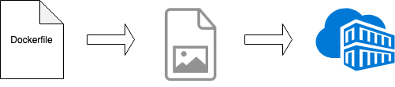

## LAB 1 - From container to a pod


The scope of this exercise is to deploy a pod in Kubernetes on a local setup in minikube.

A pod is the smallest unit in the Kubernetes. It represents a single instance of an application.

A pod is defined by:
- an application container (or in some cases multiple application containers)
- unique network IP
- storage resources

A container is another form of virtualization. It packages up applications and their dependencies, allowing them to be portable across different systems.
Unlike VMs, containers share the OS and host libraries. Containers are isolated from each other. 
   
### Prerequisites

The following need to be installed:
- Docker
- kubectl
- minikube

### Step 1 : Creating a Docker image

Docker is the most common runtime used in Kubernetes. A container will be created for an web application written in a Go.    



#### Create a web service

```
cat > main.go <<EOF
package main

import (
	"fmt"
	"log"
	"net/http"
)

func handler(w http.ResponseWriter, r *http.Request) {
	log.Println("Responding to request")
	_, _ = fmt.Fprintf(w, "Hello, World!")
	log.Println("Responded to request")
}

func main() {
	log.Println("Starting web server")
	fs := http.FileServer(http.Dir("static/"))
	http.Handle("/static/", http.StripPrefix("/static/", fs))
	log.Fatal(http.ListenAndServe(":8080", nil))
}
EOF
```

#### Create a Dockerfile

```
cat > Dockerfile <<EOF
FROM golang:latest 
RUN mkdir /app 
ADD . /app/ 
WORKDIR /app 
RUN go build -o main . 
CMD ["/app/main"]
EOF
```

#### Build the docker image

Build the docker image locally. You can [reuse the docker deamon](https://github.com/kubernetes/minikube/blob/0c616a6b42b28a1aab8397f5a9061f8ebbd9f3d9/README.md#reusing-the-docker-daemon) from minikube.

`eval $(minikube docker-env)`

`docker build . -t my-first-image:1.0.0`

You should be able to see the docker image

`docker images`

### Step 2: Create a pod configuration

#### Create a pod configuration

```
cat > pod.yaml <<EOF
---
kind: Pod
apiVersion: v1
metadata:
  name: my-first-pod
spec:
  containers:
    - name: my-first-container
      image: my-first-image:1.0.0
      imagePullPolicy: IfNotPresent

EOF
```

#### Deploy a pod
You can deploy the pod using:

`kubectl apply -f pod.yaml`

Check if the pod is running:

`kubectl get pods --all-namespaces --watch`

Describe the pod:

`kubectl describe pod my-first-pod`

#### Access the dashboard

You can access kubernetes dashboard available in minikube:  

`minikube dashboard`

#### Access the logs on that pod

`kubectl logs my-first-pod`

#### Connect to a pod

`kubectl exec -it my-first-pod bash`

### Delete pods

`kubectl delete -f pod.yaml`
